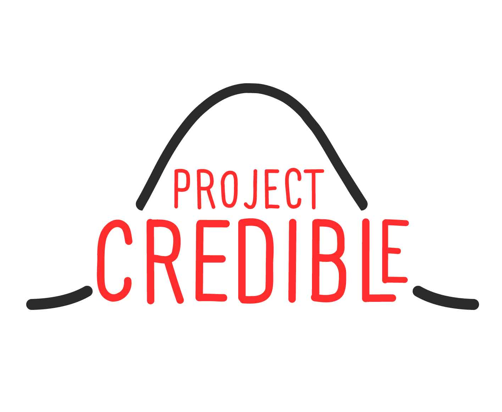
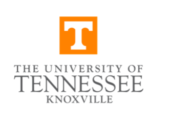

/

Welcome to the **Project CREDIBLE (Creatively Reimagining Engagement With Data in Biology Learning Environments)** website.

## Our Mission

Project CREDIBLE is a research-practice partnership intended to advance how middle and high school students use data in science classes. Funded by the National Science Foundation, we bring together teachers, researchers at the [University of Tennessee, Knoxville](https://www.utk.edu/), the [Great Smoky Mountains Institute at Tremont](https://gsmit.org/), and [DataClassroom](https://dataclassroom.com/) to transform data literacy in STEM education.

### Our Approach

We focus on four core aspects:

1.  **The Data Investigation Cycle and Core Statistical Ideas** — From posing questions to communicating conclusions alongside core statistical ideas, such as variability
2.  **Place-Based Education** — Using local environments as assets for learning
3.  **Thinking Probabilistically** — Moving beyond "right" or "wrong" to embrace uncertainty
4.  **Ambitious Science Teaching** — Engaging students with big ideas and their own thinking

## Explore the Site

- [About](about.qmd) — Learn about our mission, team, partners, and advisory board

- [Educator Network](class-2025-26.qmd) — Resources for our 2025-26 class and teacher leaders

- [The ABCs of Data](abc.qmd) — Our framework for data analysis and interpretation

- [News & Events](news.qmd) — Updates, publications, and upcoming events

- [Get Involved](get-involved.qmd) — Join our educator network or contribute to the project

- [Contact](contact.qmd) — Get in touch with our team

{width="125" height="125"} {width="173"} {width="100" height="100"}