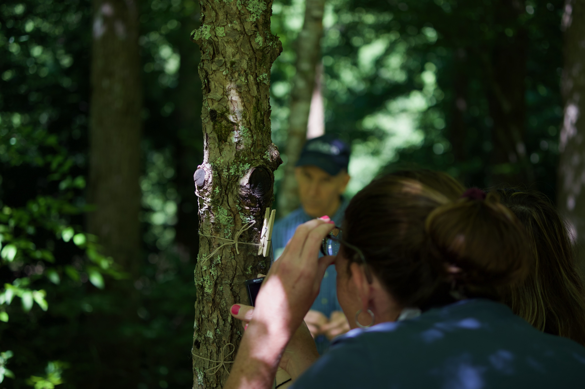

Stay updated on the latest from Project CREDIBLE, including publications, presentations, awards, and upcoming events.

## 2026

**July**

We had our third professional learning event at the Great Smoky Mountains Institute at Tremont! /

## 2025

**July**

Year 2, back at Tremont!

.jpg)

## 2025

**July**

Our first year out at the Great Smoky Mountains Institute at Tremont.

## Publications

### Journal Articles

Rosenberg, J. M., Kubsch, M., Sorge, S., Tautz, S., Pritchard, C., Garner, A. V., & Xu, Z. (2026). Embracing uncertainty in science: The ABCs of data and the confidence updater. *Science Scope, 49*(1), 44–50. <https://doi.org/10.1080/08872376.2025.2601357>

Rosenberg, J., Bonvini, M., Bray, A., Gong, R., & Yu, B. (2026). Teaching veridical data science: A panel interview with Matteo Bonvini, Andrew Bray, Ruobin Gong and Bin Yu. *Journal of Statistics and Data Science Education, 34*(2), 127–143. <https://doi.org/10.1080/26939169.2026.2632565>

Fischer, M., Pritchard, C., Xu, Z., & Rosenberg, J. (2025). Finding your way into data science education as a science teacher. *The Science Teacher, 92*(6), 49–55. <https://doi.org/10.1080/00368555.2025.2558519>

Dogucu, M., Kazak, S., & Rosenberg, J. M. (2024). The design and implementation of a Bayesian data analysis lesson for pre-service mathematics and science teachers. *Journal of Statistics and Data Science Education*, 1–12. <https://doi.org/10.1080/26939169.2024.2362148>

Rosenberg, J., & Jones, R. S. (2024). Data science learning in grades K–12: Synthesizing research across divides. *Harvard Data Science Review, 6*(3). <https://doi.org/10.1162/99608f92.b1233596>

### Book Chapters

Xu, Z., Kubsch, M., Sadler, T. D., Sorge, S., & Rosenberg, J. (in press). Reasoning with uncertainty in socioscientific issues: A Bayesian approach to SSI instruction. In Heuckmann et al. (Eds.), *Understanding uncertainty in science: A companion for science educators*. Oxford University Press.

### Conference Proceedings

Rosenbaum, L. F., & Pritchard, C. C. (2026). "A beautiful little thing for you": Emergent data visualizations as contextually responsive invitations to data reasoning. *Proceedings of the 20th International Conference of the Learning Sciences (ICLS) 2026*, 2746–2748.

Rosenbaum, L. F., Pritchard, C. C., Lanouette, K., Rosenberg, J. M., & Blikstein, P. (2026). "The amount of people that like hotdogs or hamburgers": How youth characterize what data is and what they can do with it. *Proceedings of the 20th International Conference of the Learning Sciences (ICLS) 2026*, 1602–1606.

## Presentations

### 2026

Garner, A., Rosenbaum, L., Rosenberg, J. M., Xu, Z., & Jones, K. (2026, April). *From creekbeds to confidence: How place-based professional learning expands teacher perspectives on place and data* \[Paper presentation\]. NARST 2026 Annual International Conference, Seattle, WA.

Rosenberg, J. M., Benz, G., & Lee, V. (2026, April). *Why does dealing with data really matter? Benefits and the conditions that support them* \[Roundtable presentation\]. NARST 2026 Annual International Conference, Seattle, WA.

Xu, Z., Rosenberg, J., Pritchard, C., Krebs, D., Sauer, J., Parker, A., & Hensley, K. (2026, April). *Challenges and affordances in engaging K–12 students in authentic data investigations* \[Poster presentation\]. NARST 2026 Annual International Conference, Seattle, WA.

Garner, A. V. (2026). *From creekbeds to confidence* \[Presentation\]. Great Smoky Mountains National Park Science Colloquium, Gatlinburg, TN.

Garner, A. V. (2026). *ABCs of data literacy* \[Presentation\]. Center for Science Outreach, Vanderbilt University, Nashville, TN.

Garner, A. V., Kumar, V., Ali, S., & Whipple, B. (2026). *AI and waste* \[Presentation\]. Blount County Schools, Maryville, TN.

### 2025

Xu, Z., Sauer, J., Krebs, D., & Roth, A. (2025, September). *Better together: Researchers, teachers, and nonprofits collaborate for place-based education* \[Presentation\]. Tennessee Environmental Education Association 2025 Annual Conference, Chattanooga, TN.

Sauer, J., & Krebs, D. (2025, September). *Finding clarity in chaos: Student data in place-based science learning* \[Presentation\]. Tennessee Environmental Education Association 2025 Annual Conference, Chattanooga, TN.

## Get Involved

Interested in joining our educator network? Visit our [Get Involved](get-involved.qmd) page to learn about opportunities for the 2026-27 school year.

Have news to share about Project CREDIBLE? [Contact us](contact.qmd) with updates about awards, presentations, or classroom successes!